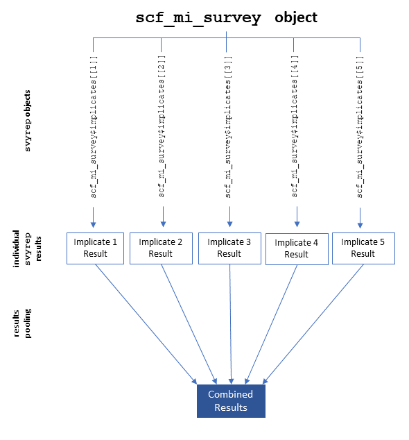

\providecommand{\pandocbounded}[1]{#1}

```{r setup session, include = F}

knitr::opts_chunk$set(
  echo = TRUE,
  warning = FALSE,
  message = FALSE
)

library(scf)
library(knitr)
library(ggplot2)
library(scales)
library(dplyr)
library(stringr)
library(tibble)
library(haven)
library(survey)
library(mitools)

set.seed(1234)
```

# Introduction

This article introduces the R package `scf` [@Cohen2025], which simplifies the analysis of the *Survey of Consumer Finances* (SCF) public-use microdata [@FRB2023a]. The SCF is a valuable resource for research on the economic circumstances, behavior, strategies, and fortunes of U.S. households. However, two features of the data make it more difficult to analyze: its (i) complex sampling design and (ii) imputation of missing data. These features improve the quality of the data but make valid analysis more technically demanding. The package `scf` makes SCF microdata analysis more accessible by scripting these handling routines in a library of easy-to-use functions. 

This package builds on the `survey` package [@Lumley2024], wrapping each of the SCF’s five imputed sets into replicate-weighted `survey::svyrepdesign()` design objects. Users can then call single-line data analytic functions that implement operations across individual implicates and then pool the resulting estimates using Rubin’s Rules [@Rubin1987] or similar appropriate functions to render parameter estimates. The package includes functions for downloading, wrangling, estimating, and visualizing population statistics. It is intended for analysts who are comfortable in R but do not want to manually script SCF-specific survey-design and imputation handling.

This paper proceeds as follows: Section 2 briefly describes the SCF and its uses. Section 3 describes the methodological challenges involved in analyzing SCF microdata. Section 4 describes the `scf` package. Section 5 reviews the `scf` package’s suite of commands and replicates officially published estimates. Section 6 reviews the strengths of the `scf` universe of functions versus alternatives. Section 7 ends with some technical notes, installation instructions, and a summary.

*Note: Upper-case “SCF” refers to the dataset; lower-case monospaced `scf` denotes the R package.* The Markdown file that produced this document is available in the paper's registered OSF repository [@Cohen2026].  An archive of the package version used to produce this document is also available on OSF [@Cohen2026a].

```{r data set up, include = F}

scf_download(2022)
scf2022 <- scf_load(2022)

```

# The Survey

The *Survey of Consumer Finances* (SCF) is a triennial survey of U.S. household finances conducted by the Federal Reserve. Each wave includes several thousand households (over 4,400 in 2022) and collects detailed information on assets, debts, income, expenditures, demographics, and financial behaviors. The Survey uses a dual-frame design combining a nationally representative area-probability sample [@Davern2024],^[Including an oversample of geographic areas with relatively high proportions of Black-headed households; see @ThompsonSuarez2017.] with a special oversample of high-wealth households identified through IRS records. These features allow the SCF to support high-quality population estimates and detailed study of financially atypical but economically consequential households (e.g., top wealth percentiles).

The same features that make the SCF uniquely valuable also complicate its analysis. Its complex structure, involving stratification, clustering, and replicate-weight variance estimation, requires analysts to use specialized tools [@RustRao1996; @Lumley2004; @Lumley2011]. In addition, the SCF handles item nonresponse through multiple imputation, distributing five implicates that represent different stochastic draws from an imputation model that predicts missing values [@Kennickell2017; @LittleRubin2019]. Valid analysis therefore requires estimating statistics separately within each implicate, and combining results appropriately to produce overall estimates.

In practice, these requirements impose substantial burdens on non-specialist anlaysts. Analysis typically involve coordinating several packages like `survey` and `mitools`, which themselves require some degree of substantive expertise to implement properly. Prevailing practice involves dozens of lines of custom code to specify replicate-weighted designs, iterate over implicates, and pool estimates. Small implementation errors, such as misspecifying replicate weights or pooling variances incorrectly, can produce biased or irreproducible results. 

The `scf` package was designed to make the analysis of SCF microdata more accessible to analysts with generalist analytic skills sets and strong interests related to household finances. It scripts the sequence of general-purpose survey analysis and missing data handling tools that one would use in an SCF microdata analysis, wrapping them in functions that will be recognizable and usable by non-specialists. 

# Package Design

This section outlines the structure and logic of the `scf` package, including its design principles, core data object, estimation flow, and software dependencies.

## Design Philosophy

The `scf` package supports valid, reproducible, and transparent analysis of *Survey of Consumer Finances* (SCF) microdata. It enables users to analyze SCF data without specialized skills. The package aims for:

- **Rigor:** Estimation routines follow established practices for multiply imputed, replicate-weighted survey data.
- **Accessibility:** Common SCF workflows are implemented in a small set of functions, reducing the amount of custom code required.
- **Transparency:** Users can access implicate-level design objects, underlying data, and intermediate results. Functions are designed to expose, rather than obscure, the structure of the analysis.

## Core Object

All `scf` operations revolve around a central object class, `scf_mi_survey`, which represents the SCF microdata for a given survey year. The object contains:

- `mi_design`: A list of five `survey::svrepdesign` objects, one per implicate, encoding the SCF’s replicate-weighted survey structure.
- `year`: The SCF survey year (e.g., 2022).
- `n_households`: The number of U.S. households represented by the SCF sample that year.

This structure enables both functional automation (via wrapper functions) and user-side transparency. Users can access individual implicates directly via `object$mi_design[[i]]` and apply any survey-compatible function for advanced diagnostics or custom modeling.

## Estimation and Pooling Logic

The `scf` package’s estimation and pooling logic is summarized in Figure 1:

```{r fig1, echo=FALSE, out.width="80%", fig.cap="Architecture of the `scf` Package Data Object and Workflow"}

```

The `scf_mi_survey` is a complex data list that includes one encoded survey design object for each of the SCF’s imputed data sets, stored as `scf2022$mi_design[[i]]`. The `scf` package encodes these survey design objects at the outset of the recommended workflow, using `survey::svrepdesign()` wrapped in the functions `scf_design()` via `scf_load()`. For any given `scf` function, an operation in the `survey` package is applied to each of the five implicates.^[For example, to calculate the means of a variable, `scf_mean()` applies the `survey::svymean()` function to each implicate, using the replicate weights and the main sampling weight. Likewise, `scf_ols()` uses `survey::svyglm()` to fit a linear regression model to each implicate.] The five separate results are generally then recombined into a single parameter estimate using Rubin’s Rules (see above) or averaged directly (for percentiles and proportions). The final result is returned as a list containing the pooled parameter estimate, its standard error, and any additional information needed for inference (e.g., confidence intervals).

## Dependencies

The `scf` package depends primarily on Lumley and colleagues' `survey` package [@Lumley2024], which provides the underlying infrastructure for complex survey analysis in R. All estimation and design logic in `scf` is built on `survey::svrepdesign()` and related methods. The package avoids additional dependencies such as `mice` opting instead to implement MI logic internally for clarity and compatibility.


# Functionality 

The package performs operations related to data infrastructure, wrangling, description, inference, modeling, visualization, and utility. Table 1 (next page) lists the exported functions in the `scf` package, grouped by usage domain.

# Examples and Validation

This section demonstrates the package’s workflow and functionality by replicating official population statistic estimates published by the U.S. Federal Reserve. The Federal Reserve generally uses a non-public version of its dataset in creating statistical reports, but it releases official estimates derived from the public-use microdata in an Excel workbook distributed on the SCF website [@FRB2023b]. Below, official estimates from that workbook are cited, mentioning the table and cell range to which the `scf` package-generated results match.

## Data Wrangling

### Data Acquisition and Loading

Users can download the SCF data and load it into R using the `scf_download()` and `scf_load()` functions. Once the data are loaded, users can apply various functions to analyze the data. The following syntax downloads and loads the object associated with the 2022 data:

```{r example load, message = FALSE, warning = FALSE, results = 'hide'}

scf_download(2022)
scf2022 <- scf_load(2022)

```

\newpage

```{r table1, echo=FALSE, results='asis'}

tab <- data.frame(
  Function = c(
    "scf_download()", "scf_load()", "scf_design()", "scf_update()", 
    "scf_subset()",
    "scf_mean()", "scf_median()", "scf_percentile()", "scf_freq()", 
    "scf_xtab()", "scf_corr()", "scf_ttest()", "scf_prop_test()",
    "scf_ols()", "scf_logit()", "scf_glm()", "scf_MIcombine()", 
    "scf_implicates()", "scf_regtable()", "scf_plot_dbar()", "scf_plot_cbar()", 
    "scf_plot_bbar()", "scf_plot_dist()", "scf_plot_hist()", "scf_plot_hex()", 
    "scf_plot_smooth()", "scf_theme()"
 ),
  Category = c(
    "Infrastructure", "Infrastructure", "Infrastructure", 
    "Wrangling", "Wrangling",
    "Descriptive", "Descriptive", "Descriptive", "Descriptive", "Descriptive", 
    "Descriptive", "Inference", "Inference",
    "Modeling", "Modeling", "Modeling", "Support", "Support", 
    "Output",
    "Visualization", "Visualization", "Visualization", 
    "Visualization", "Visualization", "Visualization", "Visualization", 
    "Visualization"
 ),
  Description = c(
    "Download and prepare raw SCF data",
    "Load SCF data and construct MI survey object",
    "Build scf_mi_survey object from implicate designs",
    "Create and change variables in SCF data object",
    "Filter SCF data using logical expressions",
    "Estimate population means with MI pooling",
    "Estimate medians via implicate averaging",
    "Estimate user-specified percentiles",
    "Tabulate category proportions, optionally by group",
    "Two-way cross-tabulations for discrete variables",
    "Pearson correlation with pooled estimates",
    "T-test for group or population mean differences",
    "Test population proportions (one- or two-sample)",
    "Ordinary least squares regression with Rubin pooling",
    "Logistic regression with optional odds ratio output",
    "Generalized linear models with a user-specified family",
    "Apply Rubin’s Rules for pooled estimates",
    "Extract implicate-level results from scf_* outputs",
    "Format and display regression output for publication",
    "Bar chart for discrete variables",
    "Bar chart for continuous-by-discrete relationships",
    "Stacked bar chart of two discrete variables",
    "Distribution plot for discrete or continuous variables",
    "Histogram for continuous variables",
    "Hexbin plot for two continuous variables",
    "Smoothed density plot for a continuous variable",
    "Default plot theme for SCF graphics"
 ),
  stringsAsFactors = FALSE
)

kable(
  tab,
  caption = "Functions in the `scf` package",
  booktabs = TRUE
)

```


### Variable Creation or Transformation

To create or change variable values, use the `scf_update()` function. Below, a logical variable named "senior" is created, which is TRUE if the household head is aged 65 or older:


```{r variable transformation example}

scf2022 <- scf_update(scf2022, senior = age >= 65)

```
## Describing Estimated Population Distributions

The suite contains a range of functions designed to extract descriptors of the estimated population distributions suggested by the microdata. 

### Univariate Continuous Distributions

Below, the estimated population mean household income for 2022 is reproduced.^[The result reproduces official estimates of mean household income in 2022 reported in the sheet "Table 1 01-22", Cell AE7.]  

```{r population mean example}

scf_mean(scf2022, ~income)

```

### Univariate Discrete Distributions

Univariate discrete distributions can be described as frequency tables using `scf_freq()`.^[Result reproduces official estimates of the distribution of household head's educational attainment levels from Sheet "Table 01 01-22", cell range AG34:AG37.  The ordinal educational scale is constructed from the raw education variable `x5931`.]

```{r frequency table example}

# Wrangling raw data
scf2022 <- scf_update(scf2022, 
            edu1 = ifelse(x5931 == 0, NA,
                    ifelse(x5931 %in% c(-1, 1:7), 1,
                     ifelse(x5931 %in% c(8), 2,
                      ifelse(x5931 %in% c(9:11), 3,
                       ifelse(x5931 %in% c(12:15),4, NA))))))
scf2022 <- scf_update(scf2022, 
                      edu1 = factor(edu1,
                                    levels = 1:4,
                                    labels = c("<HS", "HS", 
                                               "Some College", "College+")))
```
\newpage

```{r}
# Producing a frequency table of population estimates
scf_freq(scf2022, ~edu1)


```
 ### Bivariate Discrete-Discrete

The `scf_xtab()` function produces cross-tabulations of two discrete variables, allowing users to see the distribution of one variable across the categories of another.^[This result nearly replicates "Table 9 22 %s & medians" cell: B19.  Official report is 80.6932, and our estimate is 80.6332.]


```{r}

# Bound and log net worth
scf2022 <- scf_update(scf2022,
                      under35 = factor(ifelse(age < 35, 1, 0),
                                       levels = 0:1,
                                       labels = c("Over 35", "Under 35")))

# Car ownership and under 35 year-old head
scf_xtab(scf2022, ~own, ~under35, scale = "col")

```

\newpage

### Bivariate Discrete-Continuous

Use the "by" argument in functions like `scf_mean()` to estimate the mean population score across the categories of a discrete variable.^[The result replicates  official estimates of mean net worth of under-35 headed households in sheet "Table 4", cell Y18.]

```{r}
scf_mean(scf2022, ~networth, by = ~under35)
```

### Bivariate Continuous-Continuous

The `scf_corr()` function estimates the Pearson correlation between two continuous variables, returning a pooled estimate with standard error. There are no correlations reported in our replication data, but we can use this combination to demonstrate the package's visualization capabilities.

## Data Visualization

The above-cited workbook from which we are replicating official statistics does not include population-level correlation estimates, which would be estimated with the function 'scf_corr()'. However, for the purpose of including both a visualization and completing the typology of basic statistics, we include `scf_plot_hex()`. Below, the function produces a hexbin plot that visualizes the relationship between net worth (logged) and age of the household head.


```{r vizsetup}
scf2022 <- scf_update(scf2022, 
                      networth_bound = pmax(1, pmin(networth, 1e6)),
                      log_networth   = log(networth_bound)
)
```
\newpage

```{r visualization-example, fig.width=6, fig.height=4, dpi=300, fig.cap="Hexbin Plot of Household Age and Net Worth"}
scf_plot_hex(
  scf2022, ~age, ~log_networth,
  title = "Age vs. Log Net Worth",
  xlab = "Age",
  ylab = "Log Net Worth"
)

```

## Regression Analysis

Below, we calculate an OLS model predicting logged net worth on a binary variable demarcating households with heads over 65 years *versus* under 65. 


```{r ols example}
model1 <- scf_ols(scf2022, log_networth ~ senior)

```

The function `scf_regtable()` formats regression results for publication. Below, we display the results of the above model with three decimal places and output to console, as opposed to in LaTeX format or as a CSV file.


```{r}
# Show results using function scf_regtable()
scf_regtable(model1, digits = 3, output = ("console"))
```

```{r calc results, include = F}
fit <- model1
r2 <- fit$fit$r.squared
fit <- fit$results
b0 <- fit[1,]$estimate
b1 <- fit[2,]$estimate
mn_non <- exp(b0)
mn_sen <- exp(b0 + b1)
```

Non-seniors have estimated mean net worth `r dollar(mn_non)`; seniors `r dollar(mn_sen)`. Model fit registers a mean R-Squared `r round(r2, 2)`.

# Comparison to Existing Tools

A standard method for analyzing SCF data in R involves using Lumley *et al.*'s (2024) `survey` package, implemented in a workflow defined by @Damico2025. The `survey` package is the industry standard in complex survey analysis. For years, Damico's code repository had been recommended in Federal Reserve technical notes as guidance for R users who wanted to use the data.  Both are invaluable resources for using and teaching people how to use a wide range of federal survey data, including the SCF. 

The SCF’s combination of replicate weights and multiple imputation, however, requires more elaborate scripting than most federal surveys. This complexity can induce coding errors and discourages generalists from using the data. The `scf` package streamlines the Damico-style workflow by automating these steps in a small set of functions that integrate design construction, implicate iteration, and pooling. This lowers the technical barrier to valid analysis while preserving the underlying methodology.

A comparison of the workflow required to get the median household income in 2007 using both methods illustrates the difference. Both workflows yield identical statistics and standard errors; the difference lies in reduced coding surface and error exposure, though at some processing time costs.

### Traditional Method

The traditional approach, as defined in @Damico2025), requires dozens of lines of code to make the same calculation. Damico's code is replicated over more than 100 lines in Appendix A. Note that this process would be longer for data visualizations.

```{r timerx, include = F}

dam_start_scf <- Sys.time()


scf_dta_import <-
    function(this_url){
        this_tf <- tempfile()
        download.file(this_url , this_tf , mode = 'wb')
        this_tbl <- read_dta(this_tf)
        this_df <- data.frame(this_tbl)
        file.remove(this_tf)
        names(this_df) <- tolower(names(this_df))
        this_df
    }

scf_df <- 
  scf_dta_import("https://www.federalreserve.gov/econres/files/scf2007s.zip")

ext_df <- 
  scf_dta_import("https://www.federalreserve.gov/econres/files/scfp2007s.zip")

scf_rw_df <- 
  scf_dta_import("https://www.federalreserve.gov/econres/files/scf2007rw1s.zip")

# Checks of data dimensions, per Damico (2025)
stopifnot(nrow(scf_df) == nrow(scf_rw_df) * 5)
stopifnot(nrow(scf_df) == nrow(ext_df))
stopifnot(all(sort(intersect(names(scf_df) , names(ext_df))) == c('y1' , 'yy1')))
stopifnot(all(sort(intersect(names(scf_df) , names(scf_rw_df))) == c('y1' , 'yy1')))
stopifnot(all(sort(intersect(names(ext_df) , names(scf_rw_df))) == c('y1' , 'yy1')))

# Removing implicate identifier and adding column of 5s for weighting
scf_rw_df[ , 'y1' ] <- NULL
scf_df[ , 'five' ] <- 5

# Construct multiply-imputed complex survey design, per Damico (2025)

s1_df <- scf_df[ str_sub(scf_df[ , 'y1' ] , -1 , -1) == 1 , ]
s2_df <- scf_df[ str_sub(scf_df[ , 'y1' ] , -1 , -1) == 2 , ]
s3_df <- scf_df[ str_sub(scf_df[ , 'y1' ] , -1 , -1) == 3 , ]
s4_df <- scf_df[ str_sub(scf_df[ , 'y1' ] , -1 , -1) == 4 , ]
s5_df <- scf_df[ str_sub(scf_df[ , 'y1' ] , -1 , -1) == 5 , ]

# Combine to list
scf_imp <- list(s1_df , s2_df , s3_df , s4_df , s5_df)
scf_list <- lapply(scf_imp , merge , ext_df)

# Replace missing values in replicate weights with zero
scf_rw_df[ is.na(scf_rw_df) ] <- 0
scf_rw_df[ , paste0('wgt' , 1:999) ] <-
    scf_rw_df[ , paste0('wt1b' , 1:999) ] * scf_rw_df[ , paste0('mm' , 1:999) ]
scf_rw_df <- scf_rw_df[ , c('yy1' , paste0('wgt' , 1:999)) ]

# Sort table by unique identifiers, per Damico
scf_list <- lapply(scf_list , function(w) w[ order(w[ , 'yy1' ]) , ])
scf_rw_df <- scf_rw_df[ order(scf_rw_df[ , 'yy1' ]) , ]

# Define function to combine results: From Damico (2025)
scf_MIcombine <-
    function (results, variances, call = sys.call(), df.complete = Inf, ...) {
        m <- length(results)
        oldcall <- attr(results, "call")
        if (missing(variances)) {
            variances <- suppressWarnings(lapply(results, vcov))
            results <- lapply(results, coef)
        }
        vbar <- variances[[1]]
        cbar <- results[[1]]
        for (i in 2:m) {
            cbar <- cbar + results[[i]]
            # MODIFICATION:
            # vbar <- vbar + variances[[i]]
        }
        cbar <- cbar/m
        # MODIFICATION:
        # vbar <- vbar/m
        evar <- var(do.call("rbind", results))
        r <- (1 + 1/m) * evar/vbar
        df <- (m - 1) * (1 + 1/r)^2
        if (is.matrix(df)) df <- diag(df)
        if (is.finite(df.complete)) {
            dfobs <- ((df.complete + 1)/(df.complete + 3)) * df.complete *
            vbar/(vbar + evar)
            if (is.matrix(dfobs)) dfobs <- diag(dfobs)
            df <- 1/(1/dfobs + 1/df)
        }
        if (is.matrix(r)) r <- diag(r)
        rval <- list(coefficients = cbar, variance = vbar + evar *
        (m + 1)/m, call = c(oldcall, call), nimp = m, df = df,
        missinfo = (r + 2/(df + 3))/(r + 1))
        class(rval) <- "MIresult"
        rval
    }

# Define Lumley object: From Damico (2025)
scf_design <- 
    svrepdesign(
        weights = ~wgt , 
        repweights = scf_rw_df[ , -1 ] , 
        data = imputationList(scf_list) , 
        scale = 1 ,
        rscales = rep(1 / 998 , 999) ,
        mse = FALSE ,
        type = "other" ,
        combined.weights = TRUE
   )

# Calculate median income
scf_MIcombine(with(scf_design ,
    svyquantile(
        ~ income ,
        0.5 , se = TRUE , interval.type = 'quantile' 
)))

dam_end_scf <- Sys.time()
dam_time_sec <- as.numeric(difftime(dam_end_scf, dam_start_scf, units = "secs"))
```

The operation took `r round(dam_time_sec,2)` seconds in total on the test run performed in this paper.

### Via `scf` Package

Both approaches yield identical medians and standard errors. The `scf` package performs this internally, reducing dozens of lines of code to a simple call.   

```{r timer1, include = F}

# Cleanup from prior example
file.remove("scf2007.rds")

scf_start_scf <- Sys.time()
```

```{r, message=FALSE, warning=FALSE}

# Download Data
scf_download(2007)

# Load Data into R
scf2007 <- scf_load(2007)

# Calculate Median of Income
scf_median(scf2007, ~income)

```

```{r timer2, include = F}
scf_end_scf <- Sys.time()
scf_time_sec <- as.numeric(difftime(scf_end_scf, scf_start_scf, units = "secs"))

benchmark <- data.frame(
  Method = c("Traditional SCF workflow", "scf package workflow"),
  Lines_of_Code = c(78, 4),
  Runtime_Seconds = c(dam_time_sec, scf_time_sec),
  Estimates_Agree = c("Yes", "Yes"),
  stringsAsFactors = FALSE
)
```

The operation took `r round(scf_time_sec,2)` seconds in total. This is `r round((scf_time_sec / dam_time_sec),2)` times slower than the manual method. While this slower percentage-wise, the absolute time difference is likely minor for most users, and the reduced cognitive load and error risk may ultimately result in less total analysis time. 

```{r benchmark-table, results='asis', echo = F}
knitr::kable(
  benchmark,
  caption = "Benchmarking comparison of traditional SCF workflow and the `scf` package.",
  booktabs = TRUE,
  digits = 2
)
```

# Additional Notes

## Technical Notes

The `scf` package is implemented entirely in R and depends only on established CRAN infrastructure. It builds on the `survey` package [@Lumley2024] for complex‐survey estimation, including replicate‐weight support and design‐based inference. Optional graphics use `ggplot2` [@Wickham2025]; these are not required for estimation. Pooling and variance calculations for multiply imputed, replicate‐weighted data follow the public SCF technical documentation and are implemented directly within the package. 

## Reproducibility and Availability

The `scf` package is publicly available on CRAN. To install:

```{r, eval=F}

install.packages("scf")

```

The package includes all code used to generate the applied examples in Section 6 of this article. The examples are based on the 2022 wave of the Survey of Consumer Finances public-use microdata, available directly from the Federal Reserve’s website. A basic package vignette is included to illustrate core usage patterns; a more detailed vignette reproducing official SCF statistics may be added in a future release.

# Summary

The `scf` package makes SCF microdata accessible to generalist quantitative analysts. In so doing, it helps give household finance researchers easier access to a powerful and high-quality data set. The package is designed to encode best practices for working with complex survey data, including replicate-weighted estimation, multiple imputation, and robust inference. It is built on the `survey` package, which is the industry standard tool for complex survey analysis in R.

\newpage

# Appendix: Manual Implementation of SCF analysis without scf package


```{r, echo = T, eval = F}

scf_dta_import <-
    function(this_url){
        this_tf <- tempfile()
        download.file(this_url , this_tf , mode = 'wb')
        this_tbl <- read_dta(this_tf)
        this_df <- data.frame(this_tbl)
        file.remove(this_tf)
        names(this_df) <- tolower(names(this_df))
        this_df
    }

scf_df <- scf_dta_import(
  "https://www.federalreserve.gov/econres/files/scf2007s.zip")
ext_df <- scf_dta_import(
  "https://www.federalreserve.gov/econres/files/scfp2007s.zip")
scf_rw_df <- scf_dta_import(
  "https://www.federalreserve.gov/econres/files/scf2007rw1s.zip")

# Checks of data dimensions, per Damico (2025)
stopifnot(nrow(scf_df) == nrow(scf_rw_df) * 5)
stopifnot(nrow(scf_df) == nrow(ext_df))
stopifnot(all(sort(intersect(names(scf_df), 
                             names(ext_df))) == c('y1' , 'yy1')))
stopifnot(all(sort(intersect(names(scf_df), 
                             names(scf_rw_df))) == c('y1' , 'yy1')))
stopifnot(all(sort(intersect(names(ext_df), 
                             names(scf_rw_df))) == c('y1' , 'yy1')))

# Removing implicate identifier and adding column of 5s for weighting
scf_rw_df[ , 'y1' ] <- NULL
scf_df[ , 'five' ] <- 5

# Construct multiply-imputed complex survey design, per Damico (2025)
s1_df <- scf_df[ str_sub(scf_df[ , 'y1' ] , -1 , -1) == 1 , ]
s2_df <- scf_df[ str_sub(scf_df[ , 'y1' ] , -1 , -1) == 2 , ]
s3_df <- scf_df[ str_sub(scf_df[ , 'y1' ] , -1 , -1) == 3 , ]
s4_df <- scf_df[ str_sub(scf_df[ , 'y1' ] , -1 , -1) == 4 , ]
s5_df <- scf_df[ str_sub(scf_df[ , 'y1' ] , -1 , -1) == 5 , ]

# Combine to list
scf_imp <- list(s1_df , s2_df , s3_df , s4_df , s5_df)
scf_list <- lapply(scf_imp , merge , ext_df)

# Replace missing values in replicate weights with zero
scf_rw_df[ is.na(scf_rw_df) ] <- 0
scf_rw_df[ , paste0('wgt' , 1:999) ] <-
    scf_rw_df[ , paste0('wt1b' , 1:999) ] * scf_rw_df[ , paste0('mm' , 1:999) ]
scf_rw_df <- scf_rw_df[ , c('yy1' , paste0('wgt' , 1:999)) ]

# Sort table by unique identifiers, per Damico
scf_list <- lapply(scf_list , function(w) w[ order(w[ , 'yy1' ]) , ])
scf_rw_df <- scf_rw_df[ order(scf_rw_df[ , 'yy1' ]) , ]

# Define function to combine results: From Damico (2025)
scf_MIcombine <-
    function (results, variances, call = sys.call(), df.complete = Inf, ...) {
        m <- length(results)
        oldcall <- attr(results, "call")
        if (missing(variances)) {
            variances <- suppressWarnings(lapply(results, vcov))
            results <- lapply(results, coef)
        }
        vbar <- variances[[1]]
        cbar <- results[[1]]
        for (i in 2:m) {
            cbar <- cbar + results[[i]]
            # MODIFICATION:
            # vbar <- vbar + variances[[i]]
        }
        cbar <- cbar/m
        # MODIFICATION:
        # vbar <- vbar/m
        evar <- var(do.call("rbind", results))
        r <- (1 + 1/m) * evar/vbar
        df <- (m - 1) * (1 + 1/r)^2
        if (is.matrix(df)) df <- diag(df)
        if (is.finite(df.complete)) {
            dfobs <- ((df.complete + 1)/(df.complete + 3)) * df.complete *
            vbar/(vbar + evar)
            if (is.matrix(dfobs)) dfobs <- diag(dfobs)
            df <- 1/(1/dfobs + 1/df)
        }
        if (is.matrix(r)) r <- diag(r)
        rval <- list(coefficients = cbar, variance = vbar + evar *
        (m + 1)/m, call = c(oldcall, call), nimp = m, df = df,
        missinfo = (r + 2/(df + 3))/(r + 1))
        class(rval) <- "MIresult"
        rval
    }

# Define Lumley object: From Damico (2025)
scf_design <- 
    svrepdesign(
        weights = ~wgt , 
        repweights = scf_rw_df[ , -1 ] , 
        data = imputationList(scf_list) , 
        scale = 1 ,
        rscales = rep(1 / 998 , 999) ,
        mse = FALSE ,
        type = "other" ,
        combined.weights = TRUE
   )

# Calculate median income
scf_MIcombine(with(scf_design ,
    svyquantile(
        ~ income ,
        0.5 , se = TRUE , interval.type = 'quantile' 
)))


```

The operation took `r round(dam_time_sec,3)` seconds in total.

\newpage

# Statement of AI Use

Generative AI tools were used to assist with drafting and revising portions of the manuscript, primarily for clarity, organization, and prose refinement. These tools were also used as a coding reference during the development and debugging of the `scf` package. 

\newpage

# Computational Details

```{r, echo=FALSE, results='markup'}
sessionInfo()
```


\newpage

